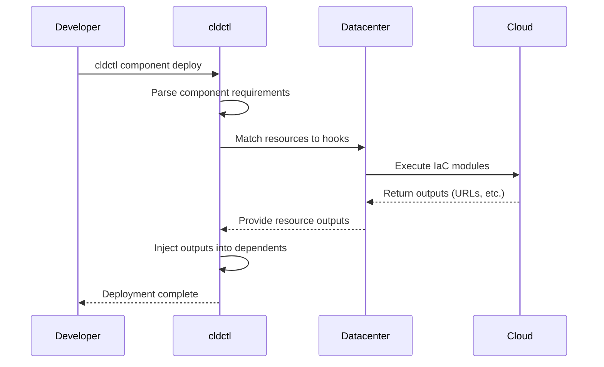

# Core Concepts

cldctl uses three complementary configuration types to achieve portable, self-service cloud deployments. Understanding how these work together is key to using cldctl effectively.

## The Three Pillars

<CardGroup cols={3}>
  <Card title="Components" icon="cube">
    **What** your application needs
  </Card>
  <Card title="Datacenters" icon="server">
    **How** resources are provisioned
  </Card>
  <Card title="Environments" icon="layer-group">
    **Where** deployments happen
  </Card>
</CardGroup>

## Components

Components are **developer-focused application bundles**. They describe what your application needs to run without specifying how those needs should be fulfilled.

A component declares:
- **Databases** - Data storage requirements (PostgreSQL, Redis, etc.)
- **Buckets** - Object storage needs (S3-compatible)
- **Deployments** - Long-running workloads (containers, VMs, or processes)
- **Functions** - Serverless compute (Next.js, Lambda handlers)
- **Services** - Internal networking between workloads
- **Routes** - External traffic routing (HTTP, gRPC)
- **Cronjobs** - Scheduled tasks
- **Variables** - Configuration inputs
- **Dependencies** - References to other components

```yaml
# cld.yml - Developer writes this
builds:
  api:
    context: ./api

databases:
  main:
    type: postgres:^15

deployments:
  api:
    image: ${{ builds.api.image }}
    environment:
      DATABASE_URL: ${{ databases.main.url }}
```

<Card title="Component Reference" icon="arrow-right" href="/components/overview">
  Learn all component resource types and configuration options
</Card>

## Datacenters

Datacenters are **platform engineer-focused infrastructure templates**. They define how component resources get provisioned using Infrastructure-as-Code.

A datacenter defines:
- **Variables** - Configuration inputs for the datacenter
- **Modules** - IaC templates (Pulumi, OpenTofu) for shared infrastructure
- **Resource Hooks** - Rules for fulfilling component resource requests

```hcl
# datacenter.hcl - Platform engineer writes this
variable "region" {
  type    = string
  default = "us-east-1"
}

environment {
  database {
    when = element(split(":", node.inputs.type), 0) == "postgres"

    module "rds" {
      build = "./modules/rds-postgres"
      inputs = {
        name    = "${environment.name}-${node.name}"
        region  = variable.region
      }
    }

    outputs = {
      url = module.rds.connection_url
    }
  }
}
```

<Card title="Datacenter Reference" icon="arrow-right" href="/datacenters/overview">
  Learn datacenter configuration and hook patterns
</Card>

## Environments

Environments are **collaboration-focused deployment configurations**. They define which components should be deployed and how they're configured for a specific context (staging, production, preview, etc.).

An environment specifies:
- **Components** - Which component artifacts to deploy
- **Variables** - Per-environment variable values
- **Scaling** - Resource allocation overrides
- **Routes** - Hostname assignments

```yaml
# staging.yml - Team configures this
name: staging
datacenter: aws-production

components:
  my-app:
    component: ghcr.io/myorg/my-app:v1.0.0
    variables:
      log_level: debug
    scaling:
      api:
        replicas: 2
    routes:
      main:
        hostnames:
          - subdomain: api
```

<Card title="Environment Reference" icon="arrow-right" href="/environments/overview">
  Learn environment configuration options
</Card>

## How They Work Together

When you deploy a component, cldctl orchestrates the interaction:



### The Resource Contract

Components and datacenters communicate through a **resource contract**:

1. **Component declares needs**: "I need a PostgreSQL database"
2. **Datacenter provides implementation**: "Here's how I provision PostgreSQL"
3. **Outputs flow back**: Connection URL is injected into dependent resources

This separation enables:
- **Portability**: Same component works in different datacenters
- **Self-service**: Developers deploy without infrastructure knowledge
- **Control**: Platform engineers define infrastructure policies

### Expression System

Components use expressions to reference values from other resources:

```yaml
environment:
  # Reference a database URL
  DATABASE_URL: ${{ databases.main.url }}
  
  # Reference a dependency's service
  AUTH_URL: ${{ dependencies.auth.services.api.url }}
  
  # Reference a variable
  LOG_LEVEL: ${{ variables.log_level }}
  
  # Reference a route's public URL
  PUBLIC_URL: ${{ routes.main.url }}
```

Expressions use the syntax `${{ resource_type.name.property }}` and are evaluated at deployment time after resources are provisioned.

## Automatic Dependency Deployment

When you deploy a component, cldctl recursively resolves its dependency tree. Any dependency not already present in the target environment is pulled and deployed automatically. This means a single `cldctl deploy` or `cldctl up` command brings up an entire multi-service application -- including transitive dependencies -- without manual orchestration.

This is the capability that makes ephemeral environments practical: one command from zero to a running preview environment.

<Card title="Dependency Deployment Guide" icon="diagram-project" href="/guides/components/dependency-deployment">
  Learn how recursive dependency deployment powers ephemeral environments
</Card>

## State Management

cldctl maintains state to track:
- Deployed environments and their components
- Resource states and outputs
- IaC module states (Pulumi/OpenTofu)

State can be stored in various backends:
- **Local** - File-based storage for development
- **S3** - AWS S3 with DynamoDB locking
- **GCS** - Google Cloud Storage
- **Azure** - Azure Blob Storage

<Card title="State Backends" icon="database" href="/architecture/state-backends">
  Learn about state backend configuration
</Card>

## Next Steps

<CardGroup cols={2}>
  <Card title="Components" icon="cube" href="/components/overview">
    Deep dive into component specification
  </Card>
  <Card title="Datacenters" icon="server" href="/datacenters/overview">
    Learn datacenter configuration
  </Card>
  <Card title="Environments" icon="layer-group" href="/environments/overview">
    Understand environment setup
  </Card>
  <Card title="CLI Reference" icon="terminal" href="/cli/overview">
    Explore available commands
  </Card>
</CardGroup>
