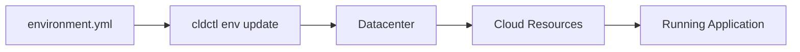

# Environments

Environments define the desired state of a deployment context, including which components to deploy and how they're configured. They serve as the collaboration point between developers and platform engineers.

## File Structure

```yaml
# environment.yml

# Metadata
name: string           # Environment name (optional, can be set via CLI)
datacenter: string     # Target datacenter (optional, can be set via CLI)

# Variables resolved from env vars and .env files
variables: map<string, EnvironmentVariable>

# Reusable values
locals: map<string, any>

# Component configurations
components: map<string, ComponentConfig>
```

## Key Concepts

<CardGroup cols={2}>
  <Card title="Variables" icon="key" href="/environments/variables">
    Secrets and config from env vars and .env files
  </Card>
  <Card title="Component Config" icon="cube" href="/environments/components">
    Configure components for deployment
  </Card>
  <Card title="Locals" icon="code" href="/environments/locals">
    Define reusable values
  </Card>
  <Card title="Scaling" icon="expand" href="/environments/scaling">
    Resource allocation and replicas
  </Card>
  <Card title="Routes" icon="route" href="/environments/routes">
    Hostname and TLS configuration
  </Card>
</CardGroup>

## Basic Example

```yaml
name: staging
datacenter: aws-production

locals:
  log_level: debug

components:
  # OCI component - uses image reference
  web-app:
    image: ghcr.io/myorg/my-app:v1.0.0
    variables:
      log_level: ${{ locals.log_level }}
    scaling:
      api:
        replicas: 2

  # Local component - uses path
  api:
    path: ./services/api
    variables:
      log_level: ${{ locals.log_level }}
```

## How Environments Work

1. **Define the environment** - Create an `environment.yml` file specifying components and configuration
2. **Create the environment** - Use `cldctl env create` to initialize
3. **Apply updates** - Use `cldctl env update <name> <config-file>` to deploy/update all components
4. **Manage lifecycle** - Update, scale, and destroy as needed



## Environment vs Component Deploy

You can deploy components in two ways:

### Using Environment File

Deploy multiple components with shared configuration:

```bash
cldctl env update staging staging.yml
```

### Individual Component Deploy

Deploy a single component directly:

```bash
cldctl deploy ghcr.io/myorg/my-app:v1.0.0 -e staging
```

The environment file approach is recommended for:
- Reproducible deployments
- Version-controlled configuration
- Multiple component coordination
- CI/CD pipelines

## Next Steps

<CardGroup cols={2}>
  <Card title="Component Configuration" icon="cube" href="/environments/components">
    Learn how to configure components
  </Card>
  <Card title="Common Patterns" icon="book" href="/environments/patterns">
    See example environment configurations
  </Card>
</CardGroup>
