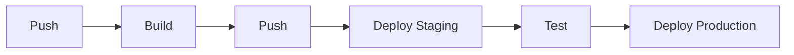

# CI/CD Integration

This guide covers integrating arcctl into CI/CD pipelines for automated builds and deployments.

## Overview

A typical CI/CD pipeline with arcctl:



## GitHub Actions

### Build and Push on Tag

```yaml
# .github/workflows/release.yml
name: Release

on:
  push:
    tags:
      - 'v*'

jobs:
  build:
    runs-on: ubuntu-latest
    steps:
      - uses: actions/checkout@v4

      - name: Set up Go
        uses: actions/setup-go@v5
        with:
          go-version: '1.22'

      - name: Install arcctl
        run: go install github.com/architect-io/arcctl@latest

      - name: Login to GHCR
        uses: docker/login-action@v3
        with:
          registry: ghcr.io
          username: ${{ github.actor }}
          password: ${{ secrets.GITHUB_TOKEN }}

      - name: Build component
        run: |
          arcctl component build . \
            -t ghcr.io/${{ github.repository }}:${{ github.ref_name }} \
            --yes

      - name: Push component
        run: |
          arcctl component push ghcr.io/${{ github.repository }}:${{ github.ref_name }} --yes
```

### Deploy on Push to Main

```yaml
# .github/workflows/deploy.yml
name: Deploy

on:
  push:
    branches:
      - main

env:
  ARCCTL_BACKEND: s3
  ARCCTL_BACKEND_S3_BUCKET: my-arcctl-state
  ARCCTL_BACKEND_S3_REGION: us-east-1

jobs:
  deploy:
    runs-on: ubuntu-latest
    permissions:
      id-token: write
      contents: read
    steps:
      - uses: actions/checkout@v4

      - name: Configure AWS credentials
        uses: aws-actions/configure-aws-credentials@v4
        with:
          role-to-assume: arn:aws:iam::123456789:role/arcctl-deploy
          aws-region: us-east-1

      - name: Install arcctl
        run: go install github.com/architect-io/arcctl@latest

      - name: Login to ECR
        uses: aws-actions/amazon-ecr-login@v2

      - name: Build and deploy to staging
        run: |
          # Build with commit SHA tag
          arcctl component build . \
            -t ${{ secrets.ECR_REGISTRY }}/my-app:${{ github.sha }} \
            --yes
          
          # Push to ECR
          arcctl component push ${{ secrets.ECR_REGISTRY }}/my-app:${{ github.sha }} --yes
          
          # Deploy to staging
          arcctl deploy ${{ secrets.ECR_REGISTRY }}/my-app:${{ github.sha }} \
            -e staging \
            --auto-approve
```

### Preview Environments for PRs

```yaml
# .github/workflows/preview.yml
name: Preview Environment

on:
  pull_request:
    types: [opened, synchronize, reopened, closed]

env:
  ARCCTL_BACKEND: s3
  ARCCTL_BACKEND_S3_BUCKET: my-arcctl-state

jobs:
  deploy-preview:
    if: github.event.action != 'closed'
    runs-on: ubuntu-latest
    steps:
      - uses: actions/checkout@v4

      - name: Install arcctl
        run: go install github.com/architect-io/arcctl@latest

      - name: Create preview environment
        run: |
          arcctl env create preview-${{ github.event.number }} \
            --datacenter aws-staging \
            --if-not-exists

      - name: Build and deploy
        run: |
          arcctl component build . \
            -t ghcr.io/${{ github.repository }}:pr-${{ github.event.number }} \
            --yes
          
          arcctl component push ghcr.io/${{ github.repository }}:pr-${{ github.event.number }} --yes
          
          arcctl deploy ghcr.io/${{ github.repository }}:pr-${{ github.event.number }} \
            -e preview-${{ github.event.number }} \
            --auto-approve

      - name: Get preview URL
        id: preview
        run: |
          URL=$(arcctl env get preview-${{ github.event.number }} --output json | jq -r '.urls[0]')
          echo "url=$URL" >> $GITHUB_OUTPUT

      - name: Comment on PR
        uses: actions/github-script@v7
        with:
          script: |
            github.rest.issues.createComment({
              issue_number: context.issue.number,
              owner: context.repo.owner,
              repo: context.repo.repo,
              body: '🚀 Preview deployed: ${{ steps.preview.outputs.url }}'
            })

  cleanup-preview:
    if: github.event.action == 'closed'
    runs-on: ubuntu-latest
    steps:
      - name: Install arcctl
        run: go install github.com/architect-io/arcctl@latest

      - name: Destroy preview environment
        run: |
          arcctl env destroy preview-${{ github.event.number }} --auto-approve
```

## GitLab CI

### Build and Deploy Pipeline

```yaml
# .gitlab-ci.yml
stages:
  - build
  - deploy-staging
  - test
  - deploy-production

variables:
  ARCCTL_BACKEND: s3
  ARCCTL_BACKEND_S3_BUCKET: my-arcctl-state
  ARCCTL_BACKEND_S3_REGION: us-east-1

build:
  stage: build
  image: golang:1.22
  script:
    - go install github.com/architect-io/arcctl@latest
    - arcctl component build . -t $CI_REGISTRY_IMAGE:$CI_COMMIT_SHA --yes
    - arcctl component push $CI_REGISTRY_IMAGE:$CI_COMMIT_SHA --yes
  only:
    - main
    - tags

deploy-staging:
  stage: deploy-staging
  image: golang:1.22
  script:
    - go install github.com/architect-io/arcctl@latest
    - arcctl deploy $CI_REGISTRY_IMAGE:$CI_COMMIT_SHA -e staging --auto-approve
  only:
    - main
  environment:
    name: staging
    url: https://staging.example.com

integration-tests:
  stage: test
  script:
    - ./scripts/run-integration-tests.sh staging
  only:
    - main

deploy-production:
  stage: deploy-production
  image: golang:1.22
  script:
    - go install github.com/architect-io/arcctl@latest
    - arcctl deploy $CI_REGISTRY_IMAGE:$CI_COMMIT_SHA -e production --auto-approve
  only:
    - tags
  environment:
    name: production
    url: https://app.example.com
  when: manual
```

## CircleCI

```yaml
# .circleci/config.yml
version: 2.1

executors:
  go:
    docker:
      - image: cimg/go:1.22

jobs:
  build:
    executor: go
    steps:
      - checkout
      - run:
          name: Install arcctl
          command: go install github.com/architect-io/arcctl@latest
      - run:
          name: Build component
          command: |
            arcctl component build . \
              -t ghcr.io/$CIRCLE_PROJECT_USERNAME/$CIRCLE_PROJECT_REPONAME:$CIRCLE_SHA1 \
              --yes
      - run:
          name: Push component
          command: |
            arcctl component push \
              ghcr.io/$CIRCLE_PROJECT_USERNAME/$CIRCLE_PROJECT_REPONAME:$CIRCLE_SHA1 \
              --yes

  deploy-staging:
    executor: go
    steps:
      - run:
          name: Install arcctl
          command: go install github.com/architect-io/arcctl@latest
      - run:
          name: Deploy to staging
          command: |
            arcctl deploy ghcr.io/$CIRCLE_PROJECT_USERNAME/$CIRCLE_PROJECT_REPONAME:$CIRCLE_SHA1 \
              -e staging \
              --auto-approve

workflows:
  build-and-deploy:
    jobs:
      - build
      - deploy-staging:
          requires:
            - build
          filters:
            branches:
              only: main
```

## Environment Variables

### Backend Configuration

Set these environment variables for state backend configuration:

```bash
# S3 Backend
export ARCCTL_BACKEND=s3
export ARCCTL_BACKEND_S3_BUCKET=my-arcctl-state
export ARCCTL_BACKEND_S3_REGION=us-east-1
export ARCCTL_BACKEND_S3_KEY=arcctl

# GCS Backend
export ARCCTL_BACKEND=gcs
export ARCCTL_BACKEND_GCS_BUCKET=my-arcctl-state
export ARCCTL_BACKEND_GCS_PREFIX=arcctl

# Azure Backend
export ARCCTL_BACKEND=azurerm
export ARCCTL_BACKEND_AZURERM_STORAGE_ACCOUNT_NAME=myaccount
export ARCCTL_BACKEND_AZURERM_CONTAINER_NAME=arcctl-state
```

### AWS Authentication

For AWS-based deployments, use IAM roles with OIDC:

```yaml
# GitHub Actions example
- name: Configure AWS credentials
  uses: aws-actions/configure-aws-credentials@v4
  with:
    role-to-assume: arn:aws:iam::123456789:role/arcctl-deploy
    aws-region: us-east-1
```

## Best Practices

### Idempotent Deployments

Use `--auto-approve` in CI but be cautious:

```bash
# Good: Deploy specific version
arcctl deploy ghcr.io/myorg/my-app:$CI_COMMIT_SHA -e staging \
  --auto-approve

# Avoid: Deploy latest (non-deterministic)
arcctl deploy ghcr.io/myorg/my-app:latest -e staging \
  --auto-approve
```

### Secrets Management

Never commit secrets. Use CI/CD secret variables:

```yaml
# GitHub Actions
- name: Deploy
  env:
    API_KEY: ${{ secrets.API_KEY }}
  run: |
    arcctl deploy ghcr.io/myorg/my-app:v1.0.0 -e staging \
      --var api_key=$API_KEY \
      --auto-approve
```

### State Locking

arcctl uses state locking to prevent concurrent modifications. If a job fails, you may need to unlock:

```bash
# Force unlock (use with caution)
arcctl env unlock staging --force
```

### Cleanup Strategy

Implement cleanup for preview environments:

```yaml
# On PR close
cleanup-preview:
  if: github.event.action == 'closed'
  steps:
    - run: arcctl env destroy preview-${{ github.event.number }} --auto-approve
```

## Next Steps

<CardGroup cols={2}>
  <Card title="Developer Workflow" icon="code" href="/guides/developer-workflow">
    Local development practices
  </Card>
  <Card title="CLI Reference" icon="terminal" href="/cli/overview">
    Complete command reference
  </Card>
</CardGroup>
