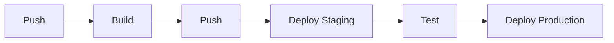

# CI/CD Integration

Integrate cldctl into your CI/CD pipeline to automate component builds, pushes, and deployments. cldctl is designed to run headlessly in any CI environment -- all you need is the CLI binary and access to your state backend.

## Typical Pipeline

A standard cldctl CI/CD pipeline follows this flow:



1. **Build** -- `cldctl build component` creates OCI artifacts from your source code
2. **Push** -- `cldctl push component` uploads artifacts to your container registry
3. **Deploy Staging** -- `cldctl deploy component` rolls out to a staging environment
4. **Test** -- Run integration/smoke tests against staging
5. **Deploy Production** -- Promote the same artifact to production

## Key Commands for CI

```bash
# Build a component artifact
cldctl build component . -t ghcr.io/myorg/my-app:$CI_COMMIT_SHA

# Push to registry
cldctl push component ghcr.io/myorg/my-app:$CI_COMMIT_SHA

# Deploy to an environment (non-interactive)
cldctl deploy component ghcr.io/myorg/my-app:$CI_COMMIT_SHA \
  -e staging --auto-approve

# Create a preview environment
cldctl create environment preview-123 -d my-datacenter

# Destroy a preview environment
cldctl destroy environment preview-123 --auto-approve
```

<Note>
Always use `--auto-approve` in CI pipelines to skip interactive confirmation prompts. Provide all required variables via `--var` or `--var-file` since interactive prompts are not available.
</Note>

## Vendor Guides

Choose your CI/CD platform for complete pipeline examples:

<CardGroup cols={3}>
  <Card title="GitHub Actions" icon="github" href="/guides/ci-cd/github-actions">
    Workflows for build, deploy, and preview environments
  </Card>
  <Card title="GitLab CI" icon="gitlab" href="/guides/ci-cd/gitlab-ci">
    Multi-stage pipeline with manual production gates
  </Card>
  <Card title="CircleCI" icon="circle" href="/guides/ci-cd/circleci">
    Jobs and workflows for build and deploy
  </Card>
</CardGroup>

## Auto-Generated Workflows

Instead of writing CI pipelines by hand, use `cldctl generate` to automatically create workflow files from your component or environment definitions:

```bash
# Generate a GitHub Actions workflow from a component
cldctl generate component workflow ./my-app --type github-actions \
  -o .github/workflows/deploy.yml

# Generate from an environment (multi-component)
cldctl generate environment workflow ./environment.yml --type github-actions \
  -o .github/workflows/deploy.yml
```

Each resource in the dependency graph becomes an independent CI job, maximizing parallelism while respecting dependency ordering. See the [Workflow Generation Guide](/guides/ci-cd/workflow-generation) for full details.

## Next Steps

<CardGroup cols={2}>
  <Card title="Workflow Generation" icon="wand-magic-sparkles" href="/guides/ci-cd/workflow-generation">
    Auto-generate CI workflows from component and environment definitions
  </Card>
  <Card title="Best Practices" icon="shield-check" href="/guides/ci-cd/best-practices">
    State backends, secrets, and deployment strategies for CI
  </Card>
  <Card title="Developer Workflow" icon="code" href="/guides/developer-workflow">
    Local development and deployment guide
  </Card>
</CardGroup>
