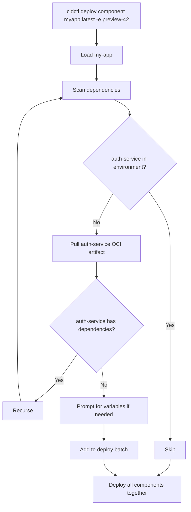

# Automatic Dependency Deployment

When you deploy a component, cldctl automatically detects, pulls, and deploys any dependency components that are not already present in the target environment. This recursive resolution is one of the key capabilities that makes ephemeral environments practical -- a single `cldctl deploy` or `cldctl up` brings an entire application stack online, no matter how many services it depends on.

## How It Works

When cldctl encounters a component with `dependencies`, it:

1. **Scans** the component's dependency declarations
2. **Checks** the target environment for each dependency -- if already deployed, it skips it
3. **Pulls** any missing dependency from the local artifact cache or remote OCI registry
4. **Inspects** each dependency for its own dependencies (transitive resolution)
5. **Prompts** for any required variables the dependencies need
6. **Deploys** the full dependency tree alongside the primary component

All of this happens in a single command.



## Example: Full-Stack Application

Consider an application with third-party service dependencies:

```yaml
# my-app/cloud.component.yml
dependencies:
  clerk: ghcr.io/myorg/clerk:v1
  stripe: ghcr.io/myorg/stripe:v1
  posthog: ghcr.io/myorg/posthog:v1

databases:
  main:
    type: postgres:^16

functions:
  web:
    src:
      path: .
      framework: nextjs
    environment:
      DATABASE_URL: ${{ databases.main.url }}
      CLERK_SECRET_KEY: ${{ dependencies.clerk.outputs.secret_key }}
      STRIPE_SECRET_KEY: ${{ dependencies.stripe.outputs.secret_key }}
      NEXT_PUBLIC_POSTHOG_KEY: ${{ dependencies.posthog.outputs.key }}

routes:
  main:
    type: http
    function: web
```

Each dependency is a lightweight pass-through component that centralizes configuration:

```yaml
# clerk/cloud.component.yml
variables:
  publishable_key:
    description: "Clerk publishable key"
    required: true
  secret_key:
    description: "Clerk secret key"
    required: true
    sensitive: true

outputs:
  publishable_key:
    value: ${{ variables.publishable_key }}
  secret_key:
    value: ${{ variables.secret_key }}
    sensitive: true
```

### Deploying

```
$ cldctl deploy component myapp:latest -e preview-42

Dependencies to deploy:
  clerk (ghcr.io/myorg/clerk:v1)
  stripe (ghcr.io/myorg/stripe:v1)
  posthog (ghcr.io/myorg/posthog:v1)

Dependency "clerk" requires the following variables:

  publishable_key (Clerk publishable key) [required]: pk_test_abc123
  secret_key (Clerk secret key) [required]: ********

Dependency "stripe" requires the following variables:

  secret_key (Stripe secret key) [required]: ********

Component:   my-app
Environment: preview-42
Datacenter:  aws-staging
Source:      ./my-app

Proceed with deployment? [Y/n]:
```

One command. One confirmation. The entire stack comes up.

## Powering Ephemeral Environments

Recursive dependency deployment is the foundation that makes ephemeral environments viable. Without it, spinning up a preview environment for a pull request would require orchestrating dozens of deploy commands in the right order. With it, a single command in CI brings up a complete, isolated copy of your application.

### PR Preview Environments

```yaml
# .github/workflows/preview.yml
name: Preview Environment

on:
  pull_request:
    types: [opened, synchronize]

jobs:
  deploy:
    runs-on: ubuntu-latest
    steps:
      - uses: actions/checkout@v4

      - name: Build component
        run: cldctl build component . -t ghcr.io/myorg/app:pr-${{ github.event.number }}

      - name: Push component
        run: cldctl push component ghcr.io/myorg/app:pr-${{ github.event.number }}

      - name: Create environment
        run: cldctl create environment preview-${{ github.event.number }} -d aws-staging

      - name: Deploy (with all dependencies)
        run: |
          cldctl deploy component ghcr.io/myorg/app:pr-${{ github.event.number }} \
            -e preview-${{ github.event.number }} \
            --var clerk_publishable_key=${{ secrets.CLERK_PK }} \
            --var clerk_secret_key=${{ secrets.CLERK_SK }} \
            --auto-approve

  cleanup:
    if: github.event.action == 'closed'
    runs-on: ubuntu-latest
    steps:
      - name: Destroy preview
        run: cldctl destroy environment preview-${{ github.event.number }} --auto-approve
```

The `deploy` step deploys the PR component **and** all its dependencies in a single command. The `--auto-approve` flag is safe here because all required dependency variables are provided via `--var`. When the PR closes, `destroy environment` tears down everything.

### Local Development

The `cldctl up` command uses the same recursive resolution:

```bash
cldctl up ./my-app -d local
```

This creates a local dev environment, pulls and deploys all missing dependencies, prompts you for any secrets they need, and starts your application with live reload. One command from a fresh clone to a running app.

## Variable Handling

Dependencies often require configuration -- API keys, secrets, project IDs. cldctl handles this differently depending on context:

### Interactive Mode (Terminal)

When running in a terminal, cldctl prompts for any required variables that the dependency needs and that weren't provided via `--var`:

```
Dependency "stripe" requires the following variables:

  secret_key (Stripe secret key) [required]: ********
  publishable_key (Stripe publishable key) [required]: pk_test_abc123
```

Sensitive variables are masked during input.

### CI / Auto-Approve Mode

In CI pipelines or when `--auto-approve` is set, cldctl cannot prompt. If a dependency has required variables without defaults, the command fails with an actionable error:

```
Error: cannot auto-deploy dependency "stripe": missing required variables: secret_key, publishable_key
Provide values with --var or deploy the dependency manually first
```

To fix this, pass variables for the dependency explicitly:

```bash
cldctl deploy component ghcr.io/myorg/app:v1.0.0 -e preview-42 \
  --var stripe_secret_key=$STRIPE_SK \
  --auto-approve
```

Or deploy the dependency once with its variables, and subsequent deployments of the main component will find it already present:

```bash
# Deploy dependency once
cldctl deploy component ghcr.io/myorg/stripe:v1 -e preview-42 \
  --var secret_key=$STRIPE_SK --auto-approve

# Now deploy the main app -- stripe is already in the environment, skipped
cldctl deploy component ghcr.io/myorg/app:v1.0.0 -e preview-42 --auto-approve
```

### Variables with Defaults

If all of a dependency's required variables have default values, no prompting or explicit `--var` flags are needed. The dependency deploys silently. This is common for configuration like feature flags or optional analytics:

```yaml
# posthog/cloud.component.yml
variables:
  key:
    description: "PostHog project API key"
    required: true
  debug:
    description: "Enable debug mode"
    default: "false"
```

## Pass-Through Components

A common pattern for third-party SaaS dependencies is the **pass-through component** -- a component with no deployments, databases, or infrastructure. It exists solely to centralize configuration and expose it as outputs:

```yaml
# anthropic/cloud.component.yml
variables:
  api_key:
    description: "Anthropic API key"
    required: true
    sensitive: true

outputs:
  api_key:
    value: ${{ variables.api_key }}
    sensitive: true
```

This pattern has several benefits:

- **Single source of truth**: the API key is entered once and shared across all components that need it
- **Environment isolation**: each environment gets its own credentials
- **Easy rotation**: update the dependency's variables and redeploy
- **Audit trail**: state tracks which components consume which secrets

Common pass-through components include authentication providers (Clerk, Auth0), payment platforms (Stripe), AI APIs (Anthropic, OpenAI), analytics (PostHog, Segment), email services (Loops, SendGrid), and messaging integrations (Slack, Intercom).

## Destroy Protection

When components are deployed with their dependency chain, cldctl records the relationships in state. This enables **destroy protection** -- if you try to destroy a component that other components depend on, cldctl blocks it:

```
$ cldctl destroy component clerk -e preview-42

Error: cannot destroy component "clerk" because the following components depend on it: my-app
Destroy those components first, or use --force to override
```

This prevents accidentally breaking a running environment by removing shared infrastructure.

## Transitive Dependencies

Dependencies can themselves have dependencies. cldctl resolves the full transitive closure:

```yaml
# app/cloud.component.yml
dependencies:
  api: ghcr.io/myorg/api:v1

# api/cloud.component.yml
dependencies:
  shared-db: ghcr.io/myorg/shared-db:v1
  auth: ghcr.io/myorg/auth:v1

# auth/cloud.component.yml
dependencies:
  clerk: ghcr.io/myorg/clerk:v1
```

Deploying `app` will automatically deploy `api`, `shared-db`, `auth`, and `clerk` -- in the right order, with proper dependency tracking. Circular dependencies are detected and produce a clear error.

## Optional Dependencies

Dependencies marked as `optional: true` are excluded from automatic deployment entirely. They are never pulled, loaded, or deployed by the recursive resolution process.

```yaml
dependencies:
  # Required -- will be auto-deployed if missing
  auth: ghcr.io/myorg/auth:v1

  # Optional -- will NOT be auto-deployed
  analytics:
    source: ghcr.io/myorg/analytics:v1
    optional: true
```

If an optional dependency happens to already be deployed in the environment (for example, from a previous manual deployment or because another component required it), its outputs are available through expressions as usual. Otherwise, those expressions resolve to empty values and the component should handle the absence gracefully.

Optional dependencies also do not participate in destroy protection -- destroying an optional dependency does not require `--force` from components that optionally depend on it.

## Skipping Existing Dependencies

cldctl never updates a dependency that is already deployed. If `clerk` is already in the environment from a previous deployment, it is skipped entirely -- even if a newer version is available in the OCI registry. This is intentional:

- Ephemeral environments get fresh dependencies every time (they start empty)
- Long-lived environments maintain stability -- dependency upgrades are explicit
- No surprise changes to shared infrastructure during a component redeploy

To update a dependency, deploy it explicitly:

```bash
cldctl deploy component ghcr.io/myorg/clerk:v2.0.0 -e staging
```

## Next Steps

<CardGroup cols={2}>
  <Card title="Dependencies Reference" icon="diagram-project" href="/components/dependencies">
    Full schema reference for component dependencies
  </Card>
  <Card title="CI/CD Best Practices" icon="rotate" href="/guides/ci-cd/best-practices">
    Setting up automated deployments
  </Card>
  <Card title="Environment Patterns" icon="clone" href="/environments/patterns">
    Common patterns for preview, staging, and production
  </Card>
  <Card title="Managing Environments" icon="gear" href="/guides/managing-environments">
    Day-to-day environment operations
  </Card>
</CardGroup>
