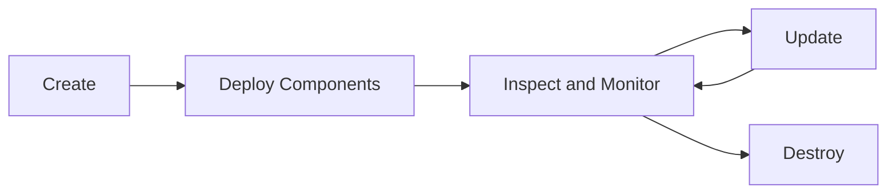

# Managing Environments

This guide covers the day-to-day operations platform engineers perform to create, inspect, update, and destroy environments running on their datacenters.

## Environment Lifecycle

Environments go through a predictable lifecycle:



## Creating Environments

Create an environment tied to a deployed datacenter:

```bash
# Create a new environment
cldctl create environment staging -d aws-production

# Create with a variable file
cldctl create environment staging -d aws-production --var-file ./vars/staging.dcvars
```

Each environment gets its own isolated set of resources (namespaces, databases, networking) as defined by the datacenter configuration.

### Environment Configuration Files

For repeatable setups, define environments in YAML:

```yaml
# environment.yml
name: staging
datacenter: aws-production

components:
  web-app:
    component: ghcr.io/myorg/web-app:v1.5.0
    variables:
      log_level: debug
    routes:
      main:
        hostnames:
          - host: staging.example.com

  api:
    component: ghcr.io/myorg/api:v2.0.0
    variables:
      jwt_secret: ${JWT_SECRET}
```

Apply the configuration:

```bash
cldctl update environment staging environment.yml
```

## Deploying Components

Deploy components into an environment:

```bash
# Deploy from OCI artifact
cldctl deploy component ghcr.io/myorg/web-app:v1.5.0 -e staging

# Deploy with variables
cldctl deploy component ghcr.io/myorg/web-app:v1.5.0 -e staging \
  --var log_level=debug \
  --var api_key=$API_KEY

# Auto-approve for scripted workflows
cldctl deploy component ghcr.io/myorg/web-app:v1.5.0 -e staging --auto-approve
```

### Updating Components

Deploy a new version to update a running component:

```bash
cldctl deploy component ghcr.io/myorg/web-app:v1.6.0 -e staging
```

cldctl shows an execution plan of what will change:

```
Execution Plan:

  deployment "api"
    ~ update: image ghcr.io/myorg/web-app-build-api:v1.5.0
           -> ghcr.io/myorg/web-app-build-api:v1.6.0

Plan: 0 to create, 1 to update, 0 to destroy

Proceed with deployment? [Y/n]:
```

## Inspecting Infrastructure

### List Datacenters

See all deployed datacenters and their status:

```bash
cldctl list datacenter
```

```
NAME             SOURCE                                    ENVIRONMENTS
aws-production   ghcr.io/myorg/aws-dc:v2.1.0              3
do-staging       ghcr.io/myorg/do-k8s-dc:v1.0.0           1
local-dev        ./local                                   2
```

### Get Datacenter Details

Inspect a specific datacenter's configuration and variables:

```bash
cldctl get datacenter aws-production
```

### List Environments

See all active environments:

```bash
cldctl list environment
```

```
NAME          DATACENTER        COMPONENTS   STATUS
production    aws-production    5            healthy
staging       aws-production    3            healthy
preview-42    aws-production    1            deploying
dev           local-dev         2            healthy
```

### Get Environment Details

Drill into a specific environment:

```bash
cldctl get environment staging
```

This shows the environment's datacenter, deployed components, resource counts, and route URLs.

### List Components in an Environment

See what's deployed:

```bash
cldctl list component -e staging
```

```
NAME         VERSION                                    RESOURCES   STATUS
web-app      ghcr.io/myorg/web-app:v1.5.0              6           running
api          ghcr.io/myorg/api:v2.0.0                   4           running
auth         ghcr.io/myorg/auth:v1.0.0                  3           running
```

### Get Component Details

Inspect a component's full resource graph:

```bash
cldctl get component web-app -e staging
```

This shows every resource the component owns (databases, deployments, services, routes) with their current state and outputs.

## Viewing Logs

Query logs across your infrastructure:

```bash
# All logs from an environment
cldctl logs -e staging

# Logs from a specific component
cldctl logs -e staging web-app

# Logs from a specific resource type
cldctl logs -e staging web-app/deployment

# Logs from a specific deployment
cldctl logs -e staging web-app/deployment/api

# Stream logs in real-time
cldctl logs -e staging -f

# Logs from the last 5 minutes
cldctl logs -e staging --since 5m

# Logs from the last hour
cldctl logs -e staging --since 1h
```

<Note>
Log querying requires the datacenter to provide a log query backend (e.g., Loki). The local Docker datacenter includes this out of the box. For cloud datacenters, configure the `observability` hook to enable log querying.
</Note>

## Observability Dashboards

If your datacenter includes an observability hook with a dashboard URL, open it directly from the CLI:

```bash
# Open the Grafana dashboard for an environment
cldctl observability dashboard -e staging
```

This opens the datacenter-configured dashboard in your default browser, pre-filtered to the specified environment.

## Destroying Resources

### Destroy a Component

Remove a single component from an environment:

```bash
# Destroy a component
cldctl destroy component web-app -e staging

# Force destroy (skip dependency checks)
cldctl destroy component shared-db -e staging --force

# Auto-approve for scripted workflows
cldctl destroy component web-app -e staging --auto-approve
```

<Warning>
Using `--force` bypasses dependency checks. Other components that depend on the destroyed component may break.
</Warning>

### Destroy an Environment

Tear down an entire environment and all its resources:

```bash
# Destroy environment (prompts for confirmation)
cldctl destroy environment staging

# Auto-approve
cldctl destroy environment staging --auto-approve
```

This destroys all components, databases, and infrastructure provisioned for the environment.

### Destroy a Datacenter

Remove a datacenter and all its shared infrastructure:

```bash
cldctl destroy datacenter aws-staging
```

<Warning>
You must destroy all environments on a datacenter before destroying the datacenter itself.
</Warning>

## Common Operational Patterns

### Preview Environment Cleanup

Clean up stale preview environments in a scheduled job:

```bash
#!/bin/bash
# cleanup-previews.sh - Run on a schedule (e.g., nightly cron)

# List environments and find previews older than 7 days
for env in $(cldctl list environment --output json | jq -r '.[] | select(.name | startswith("preview-")) | .name'); do
  echo "Destroying stale preview: $env"
  cldctl destroy environment "$env" --auto-approve
done
```

### Blue/Green Deployments

Use two environments for zero-downtime deployments:

```bash
# Deploy new version to green
cldctl deploy component ghcr.io/myorg/app:v2.0.0 -e green --auto-approve

# Verify green is healthy
cldctl get component app -e green

# Switch traffic (update DNS or load balancer)
# Then destroy old blue
cldctl destroy environment blue --auto-approve
```

### Environment Promotion

Promote a configuration across environments:

```bash
# Deploy to staging
cldctl deploy component ghcr.io/myorg/app:v1.5.0 -e staging --auto-approve

# Run tests against staging
./scripts/smoke-test.sh staging

# Promote to production
cldctl deploy component ghcr.io/myorg/app:v1.5.0 -e production --auto-approve
```

## Next Steps

<CardGroup cols={2}>
  <Card title="Platform Engineer Workflow" icon="gear" href="/guides/platform-engineer-workflow">
    Authoring datacenters and IaC modules
  </Card>
  <Card title="Local Datacenter" icon="docker" href="/guides/datacenters/local">
    Lightweight datacenter for local development
  </Card>
  <Card title="AWS ECS Datacenter" icon="aws" href="/guides/datacenters/aws-ecs">
    Production datacenter on AWS ECS Fargate
  </Card>
  <Card title="CLI Reference" icon="terminal" href="/cli/overview">
    Complete command reference
  </Card>
</CardGroup>
