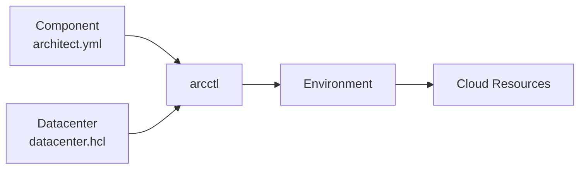

# arcctl

arcctl is a command-line tool designed to help developers create and deploy cloud-native applications in a portable fashion—**write once, deploy anywhere**.

The tool bridges the gap between application development and infrastructure management by separating concerns into three distinct configuration paradigms:

<CardGroup cols={3}>
  <Card title="Components" icon="cube" href="/components/overview">
    Developer-focused application bundles that describe what your app needs without infrastructure details.
  </Card>
  <Card title="Datacenters" icon="server" href="/datacenters/overview">
    Platform engineer-focused infrastructure templates that define how resources are provisioned.
  </Card>
  <Card title="Environments" icon="layer-group" href="/environments/overview">
    Collaboration-focused deployment configurations that connect components to datacenters.
  </Card>
</CardGroup>

## The Problem

Modern cloud-native development requires developers to juggle multiple concerns:

- **Infrastructure complexity**: Learning Kubernetes, Terraform, cloud-specific services
- **Environment inconsistency**: "Works on my machine" but breaks in production
- **Configuration sprawl**: Managing Docker Compose, Helm charts, IaC modules separately
- **Team coordination**: Developers waiting on platform engineers for infrastructure changes

## The Solution

arcctl provides **true self-service**: developers can create environments and deploy applications without infrastructure knowledge, while platform engineers maintain control over how infrastructure behaves.

### How It Works



1. **Developers** write `architect.yml` files describing their application's needs (databases, deployments, routes)
2. **Platform engineers** write `datacenter.hcl` files defining how those needs are fulfilled (AWS RDS, Kubernetes, etc.)
3. **arcctl** matches component requirements to datacenter hooks, orchestrating deployments across any infrastructure

### The Contract

Components and datacenters communicate through a **resource contract**. When a component is deployed:

1. arcctl extracts all cloud resources from the component (databases, services, deployments, etc.)
2. Each resource is matched against hooks defined in the datacenter
3. The datacenter fulfills each resource request using its configured IaC modules
4. Output values (URLs, credentials, etc.) are passed back to dependent resources

This contract allows components to be **portable across any datacenter** that implements the required resource hooks.

## Goals

<AccordionGroup>
  <Accordion title="Enable developers to describe cloud applications without learning IaC">
    Write familiar YAML syntax similar to Docker Compose. No need to learn Terraform, Pulumi, or Kubernetes manifests.
  </Accordion>
  <Accordion title="Enable platform engineers to create reusable infrastructure templates">
    Define once how databases, deployments, and routes should be provisioned. Apply consistently across all applications.
  </Accordion>
  <Accordion title="Provide portable application bundles">
    Build components once, deploy to any datacenter without modification. Switch cloud providers without changing application code.
  </Accordion>
  <Accordion title="Automate dependency management">
    Service discovery, credential generation, and configuration injection happen automatically based on declared requirements.
  </Accordion>
  <Accordion title="Support ephemeral environments">
    Spin up complete application stacks for development, testing, and preview environments on demand.
  </Accordion>
</AccordionGroup>

## Quick Example

Here's a simple web application with a database:

```yaml architect.yml
databases:
  main:
    type: postgres:^15

deployments:
  api:
    build:
      context: ./api
    environment:
      DATABASE_URL: ${{ databases.main.url }}

services:
  api:
    deployment: api
    port: 8080

routes:
  main:
    type: http
    service: api
```

Deploy it to any environment:

```bash
# Quick start for development
arcctl up

# Deploy to staging
arcctl deploy ./my-app -e staging
```

## Next Steps

<CardGroup cols={2}>
  <Card title="Quickstart" icon="rocket" href="/quickstart">
    Get started with arcctl in 5 minutes
  </Card>
  <Card title="Core Concepts" icon="book" href="/concepts/overview">
    Deep dive into components, datacenters, and environments
  </Card>
  <Card title="Developer Workflow" icon="code" href="/guides/developer-workflow">
    Learn the complete developer experience
  </Card>
  <Card title="CLI Reference" icon="terminal" href="/cli/overview">
    Complete command reference
  </Card>
</CardGroup>
