# Graph Integration Tests

Integration tests in `integration_test.go` verify graph construction end-to-end by loading real datacenter HCL and component YAML, then asserting on the resulting graph nodes, edges, and topological ordering.

These tests exist because **unit tests for the builder alone cannot catch regressions** that originate in the datacenter/component loading pipeline. For example, a change to datacenter hook output validation can silently prevent graph construction — something only an integration test spanning the full load → detect → build path can catch.

## Test Pipeline

Every integration test follows the same pipeline, which mirrors `engine.Deploy()`:

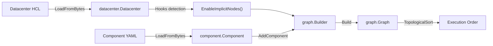

## Test Helpers

| Helper | Purpose |
|--------|---------|
| `loadDatacenter(t, hcl)` | Parses HCL string via `datacenter.NewLoader().LoadFromBytes()` — validates hooks, outputs, and structure |
| `loadComponent(t, yaml)` | Parses YAML string via `component.NewLoader().LoadFromBytes()` — validates schema, references, and types |
| `buildGraphFromDatacenter(t, dc, components)` | Replicates the `engine.Deploy()` integration point: detects hooks on the datacenter, calls `EnableImplicitNodes()`, adds all components, and builds the graph |

---

## 1. Hook Detection → EnableImplicitNodes

These tests verify that datacenter hook presence correctly controls whether `databaseUser` and `networkPolicy` implicit nodes are created. This is the integration point between `pkg/schema/datacenter` (hook parsing) and `pkg/graph` (conditional node creation).

All four tests use the same component:

```yaml
databases:
  main: { type: "postgres:^16" }
deployments:
  api:
    image: api:latest
    environment:
      DATABASE_URL: "${{ databases.main.url }}"
      AUTH_URL: "${{ services.auth.url }}"
services:
  auth: { deployment: api, port: 8080 }
```

### `TestIntegration_HookDetection_BothHooksPresent`

Datacenter defines both `databaseUser` and `networkPolicy` hooks.

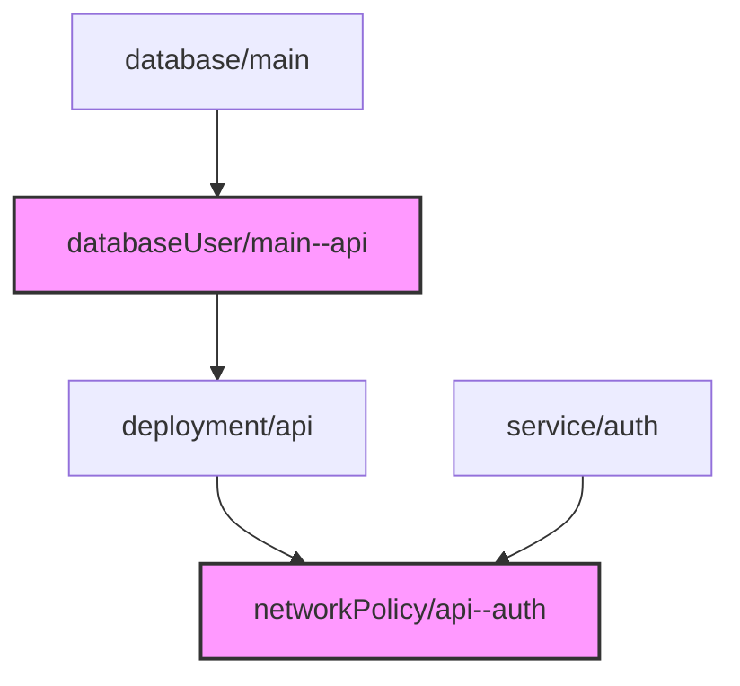

**Asserts:** Both implicit node types are present.

### `TestIntegration_HookDetection_OnlyDatabaseUserHook`

Datacenter defines only `databaseUser`.

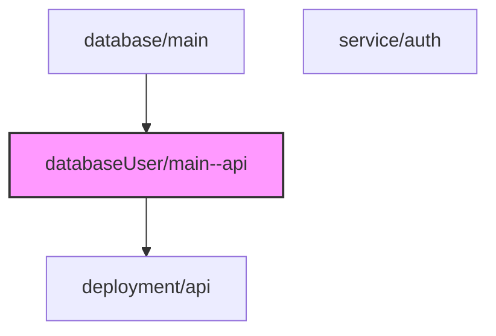

**Asserts:** `databaseUser` present, `networkPolicy` absent.

### `TestIntegration_HookDetection_OnlyNetworkPolicyHook`

Datacenter defines only `networkPolicy`.

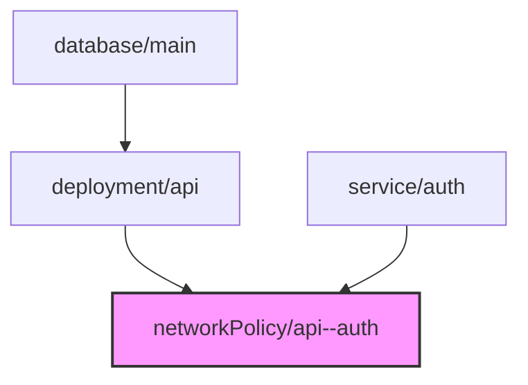

**Asserts:** `networkPolicy` present, `databaseUser` absent. Deployment depends directly on database.

### `TestIntegration_HookDetection_NoImplicitHooks`

Datacenter defines `database` hook but no `databaseUser` or `networkPolicy`.

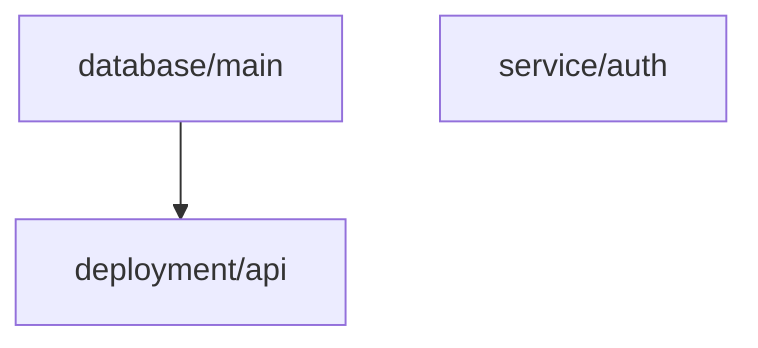

**Asserts:**
- Neither implicit node type is created
- Deployment depends **directly** on database (no intermediary)

---

## 2. Full Graph Construction

These tests load realistic component YAML paired with datacenter HCL and verify the complete graph structure: node existence, types, dependency edges, and topological ordering.

### `TestIntegration_FullGraph_WebAppWithDatabase`

Typical web app — database, deployment, service, route. No implicit hooks.

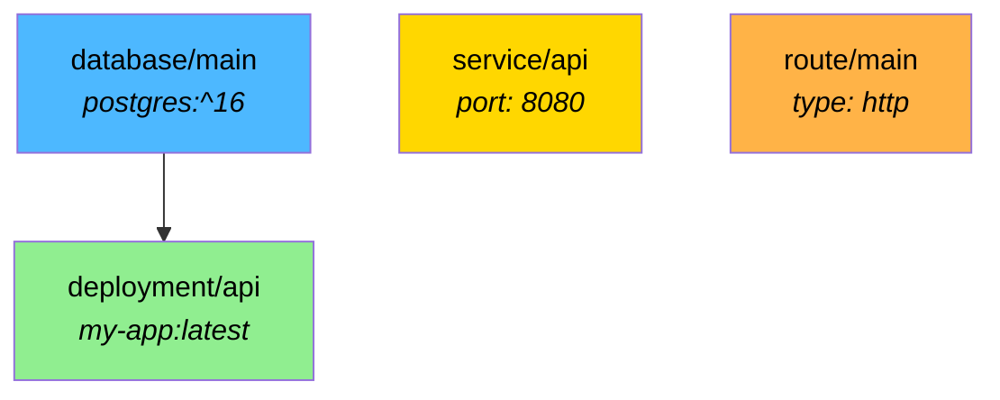

> Routes and services intentionally have **no dependency edges** to their targets. Services are stable networking abstractions (like Kubernetes Services) and routes are external routing config — both can exist before backends are ready.

**Asserts:**
- All 4 node types exist with correct `NodeType`
- Deployment depends on database (via expression)
- Route and service `DependsOn` are empty
- Topological sort: database before deployment

### `TestIntegration_FullGraph_WithDatabaseUserHook`

Datacenter defines `databaseUser` hook. Two deployments reference the same database.

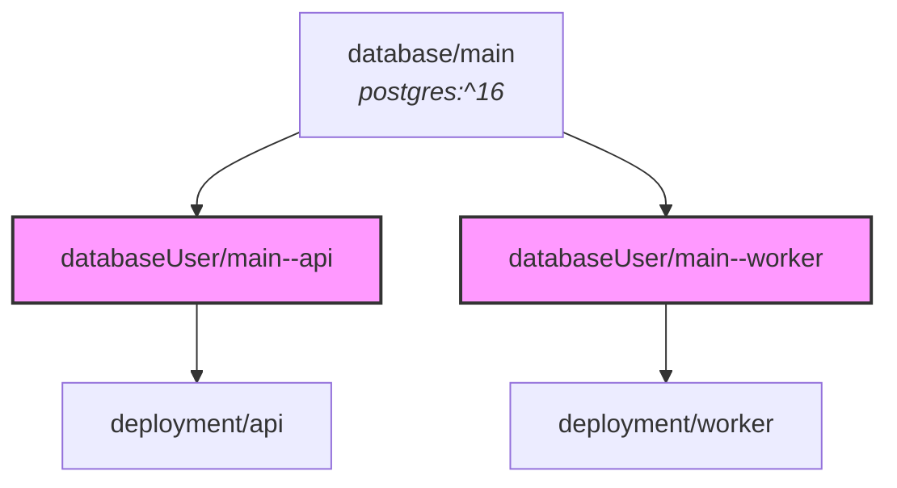

**Asserts:**
- One `databaseUser` node per consumer (fan-out pattern)
- Each consumer depends on its own `databaseUser`, **not** directly on database
- `databaseUser` inputs carry `database` and `consumer` metadata
- Topological order: database → databaseUser → deployment

### `TestIntegration_FullGraph_DatabaseUserHookWithWhenClause`

Mirrors the local datacenter pattern: `databaseUser` hook has `when = element(split(":", node.inputs.type), 0) == "postgres"`. Component uses both Postgres and Redis.

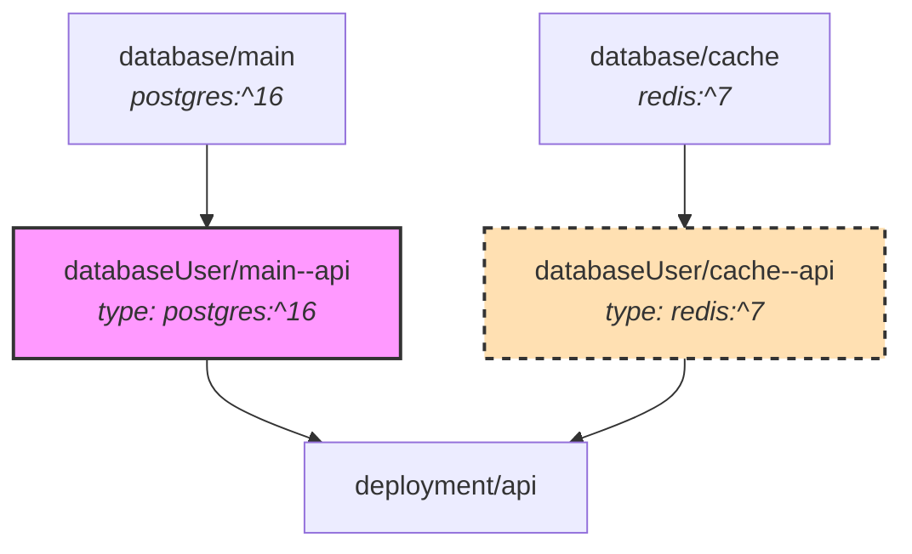

> **Key insight:** The graph builder creates `databaseUser` nodes for **all** databases when the datacenter has any `databaseUser` hook. The `when` clause is evaluated at **execution time** by the executor, not at graph construction time. A non-matching `databaseUser` (Redis) falls back to pass-through behavior — the consumer inherits the parent database's connection details.

**Asserts:**
- Both `databaseUser/main--api` (Postgres) and `databaseUser/cache--api` (Redis) nodes exist
- Each carries the correct `type` input (`postgres:^16` and `redis:^7`) for executor `when` evaluation
- Deployment depends on both `databaseUser` nodes, not directly on databases
- Topological sort: 5 nodes (2 databases + 2 databaseUser + 1 deployment)

### `TestIntegration_FullGraph_WithMigrations`

Database with `migrations` block generates a task node. Datacenter also has `databaseUser` hook.

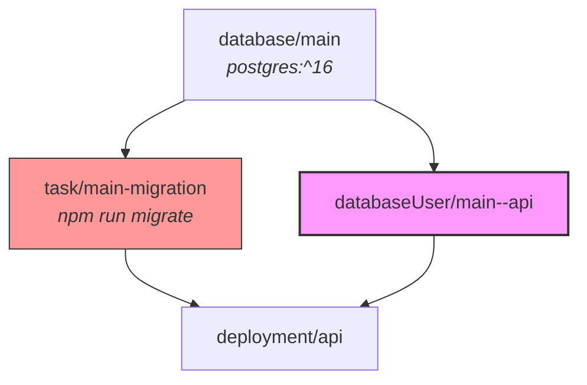

**Asserts:**
- Task node exists with `NodeTypeTask`
- Task depends on database
- Deployment depends on **both** its `databaseUser` **and** the migration task (two inbound edges)
- Topological order respects both paths: database < task < deployment, database < databaseUser < deployment

### `TestIntegration_FullGraph_ComplexComponent`

Exercises the full breadth of node types: 2 databases, 1 bucket, 1 deployment, 1 function, 1 service, 2 routes. No implicit hooks.

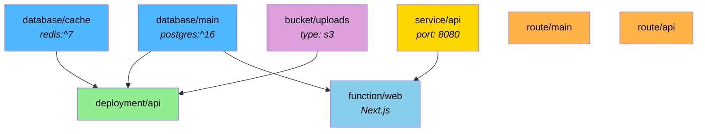

**Asserts:**
- All 8 nodes exist with correct types
- Exact node count = 8 (no implicit nodes)
- Deployment depends on both databases and bucket
- Function depends on database and service
- Service and routes have no dependency edges

---

## 3. Multi-Component Graphs

### `TestIntegration_MultiComponent_IndependentComponents`

Two components with no relationship deployed into the same environment.

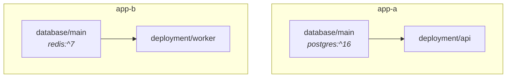

**Asserts:**
- Both components have their own namespaced nodes
- **No cross-component edges** — app-a nodes never appear in app-b's `DependsOn`
- Topological sort succeeds (4 total nodes)

### `TestIntegration_MultiComponent_WithDependencies`

`my-app` declares `auth-service` as a required dependency.

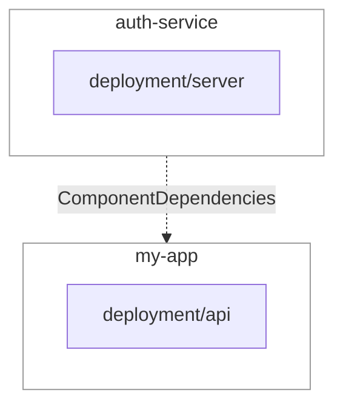

**Asserts:**
- Both components' nodes exist
- `ComponentDependencies["my-app"]` contains `"auth-service"`
- `auth-service` has no dependencies

### `TestIntegration_MultiComponent_OptionalDependency`

Component declares both a required (`auth`) and optional (`analytics`) dependency.

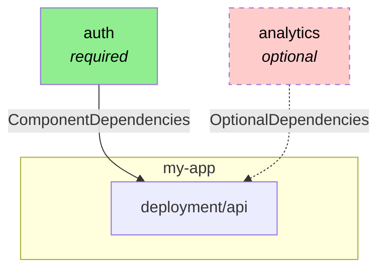

**Asserts:**
- Required dependency tracked in `ComponentDependencies`
- Optional dependency tracked **only** in `OptionalDependencies` (not in `ComponentDependencies`)

---

## 4. Datacenter Validation Regression Tests

These tests guard against the specific regression that previously broke all deployments: overly strict hook output validation causing `datacenter.Load()` to fail silently.

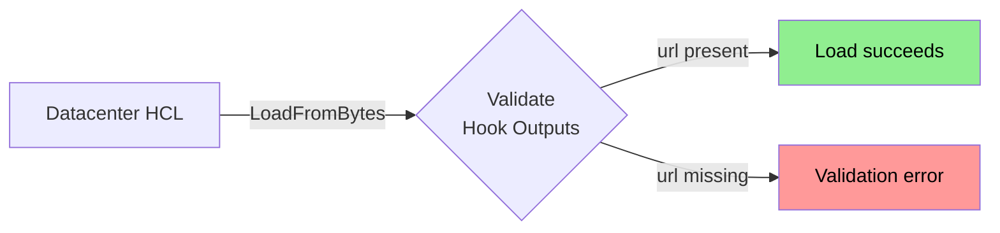

### `TestIntegration_DatacenterValidation_DatabaseUserHookMinimalOutputs`

**Regression guard.** A `databaseUser` hook providing only `url` (the minimum required output) must load successfully.

> Previously required `host`, `port`, `url` — which broke all official datacenter templates because `host` and `port` are typically inherited from the parent database via the expression resolver's per-field fallback.

### `TestIntegration_DatacenterValidation_DatabaseUserHookWithAllOutputs`

A `databaseUser` hook providing all outputs (`host`, `port`, `username`, `password`, `url`). Verifies the outputs are accessible via the hook interface.

### `TestIntegration_DatacenterValidation_DatabaseUserHookMissingURL`

A `databaseUser` hook that omits the required `url`. **Must fail** validation with an error mentioning `url`.

### `TestIntegration_DatacenterValidation_EmptyEnvironment`

`environment {}` with no hooks at all. Loads successfully; all hook lists are empty.

---

## 5. Node Count Guards

These tests assert **exact node counts** for a fixed component to detect unintended node creation or omission. All three tests use the same component definition:

```yaml
databases:
  main: { type: "postgres:^16" }
  cache: { type: "redis:^7" }
deployments:
  api:
    environment:
      DATABASE_URL: "${{ databases.main.url }}"
      REDIS_URL: "${{ databases.cache.url }}"
      AUTH_URL: "${{ services.auth.url }}"
  worker:
    environment:
      DATABASE_URL: "${{ databases.main.url }}"
services:
  auth: { deployment: api, port: 8080 }
```

### `TestIntegration_NodeCount_NoImplicitNodes`

No `databaseUser` or `networkPolicy` hooks.

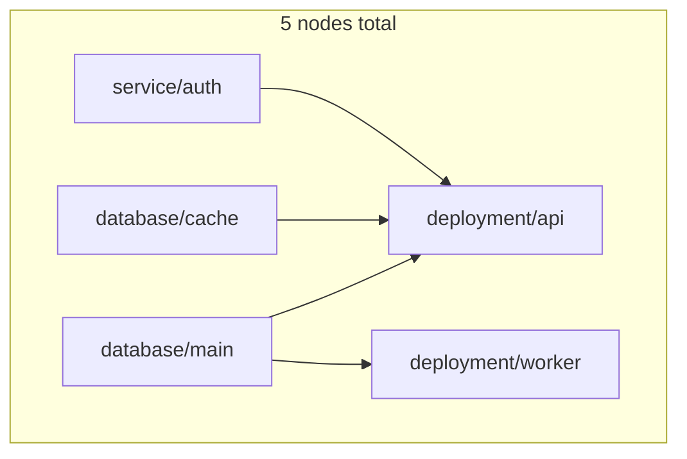

**Asserts:** Exactly **5** nodes.

### `TestIntegration_NodeCount_WithDatabaseUserHook`

Datacenter adds a `databaseUser` hook. Three consumer relationships create three implicit nodes.

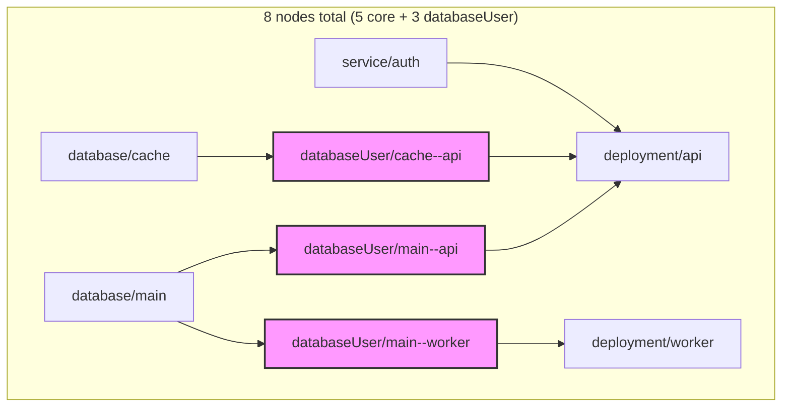

**Asserts:** Exactly **8** nodes. Each `databaseUser` node exists by name.

### `TestIntegration_NodeCount_WithBothImplicitHooks`

Datacenter adds both `databaseUser` and `networkPolicy` hooks. The `api` deployment references `service/auth`, creating one `networkPolicy` leaf.

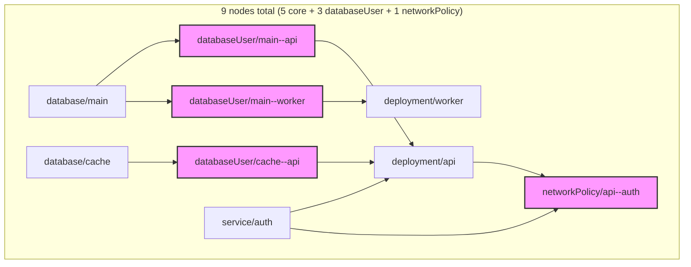

**Asserts:** Exactly **9** nodes. `networkPolicy` depends on both the workload and the service.

---

## Coverage Summary

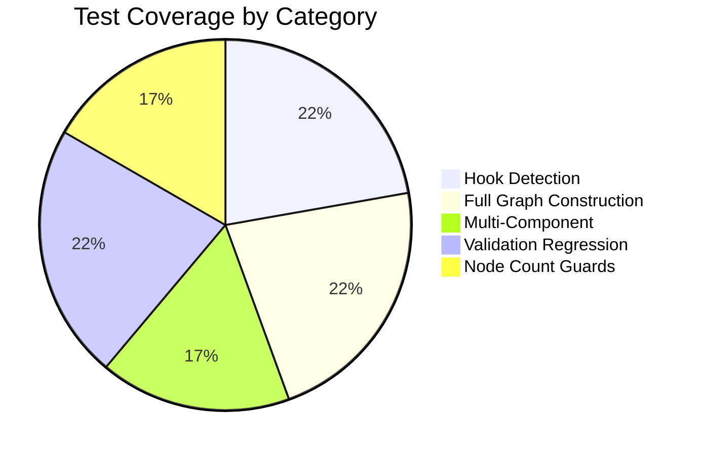

| Gap | Test(s) |
|-----|---------|
| Datacenter hook detection doesn't reach graph builder | Hook Detection group (4 tests) |
| Hook output validation breaks datacenter loading silently | Validation Regression group (4 tests) |
| Implicit nodes appear/disappear unexpectedly | Node Count group (3 tests) |
| Dependency rewiring when databaseUser is interposed | `FullGraph_WithDatabaseUserHook` |
| Multi-component dependency isolation | `MultiComponent_IndependentComponents` |
| Component-level dependency tracking (required vs optional) | `MultiComponent_WithDependencies`, `MultiComponent_OptionalDependency` |
